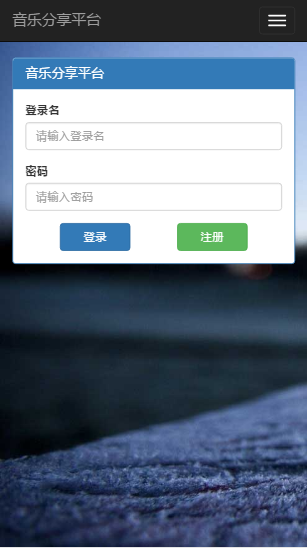

# musicShare
音乐分享平台（同一项目，四种主流框架搭建）

 
 
 
 

该项目使用四种主流框架搭建，项目本身很简单，可能让您见笑，但功能不是目的，本人更希望这份项目能够帮助更多的人学会运用前端不同的框架与了解它们的之间的差别

## 在线项目展示（移动端或电脑端）

`angular` http://47.92.85.220:8080

`vue` http://47.92.85.220:8081

`react` http://47.92.85.220:8082/#/main

`angular2` http://47.92.85.220:8083

测试账号 hjp或者hjp2 密码都是123456

## 目录索引

[angular框架版本](#angular)

[vue框架版本](#vue)

[react框架版本](#react)

[angular2框架版本](#angular2)

后台使用nodeJS与mongoDB, 想拉下来自己搭建测试的同学详见下方的 [部署说明](#deploy)

[项目页面说明](#page)

[项目自制组件说明](#components)

[数据库说明](#database)

[后续更新](#next)

<h2 id="angular">MS-angular</h2>
使用原生JS搭建angular框架

无自动化构建工具

前端包用bower下载，为了方便就直接放在git里面了

[请进入该文件夹查看更多angular项目相关说明](https://github.com/hjp007/musicShare/tree/master/MS-angular)

<h2 id="vue">MS-vue-ES6</h2>
使用webpack自动化构建工具构建

项目使用ECMAscript6语法

[请进入该文件夹查看更多vue项目相关说明](https://github.com/hjp007/musicShare/tree/master/MS-vue-ES6)

<h2 id="react">MS-react-ES6</h2>
使用webpack自动化构建工具构建

项目使用ECMAscript6语法

[请进入该文件夹查看更多react项目相关说明](https://github.com/hjp007/musicShare/tree/master/MS-react-ES6)

<h2 id="angular2">MS-angular2-TS</h2>
使用webpack自动化构建工具构建

项目使用Typescript语法

[请进入该文件夹查看更多angular2项目相关说明](https://github.com/hjp007/musicShare/tree/master/MS-angular2-TS)

<h2 id='page'>项目页面说明</h2> 
本项目是音乐分享平台，利用七牛云存储音乐文件，来达到在线听音乐，上传音乐，添加好友，分享音乐链接的功能

本项目结构简单，可以更好的上手对于框架的使用

一共6个页面

### main
###### 首页欢迎页面
 

### login
###### 登录页面
 

### home
###### 个人主页面
 

### apply
###### 注册账号页面
 

### checkFriendRequest
###### 好友管理页面
 
 

### checkShareRequest
###### 分享管理页面
 
 
 

<h2 id="components">项目自制组件说明</h2> 
项目一共用了4个自制组件，分别用框架不同形式构建，其中musicMessageBox比较特殊，是全局的组件

### musicMessageBox
###### 信息提示与确认框（封装了bootstrap的UI,封装方法与musicModal有很大不同）
 
 

### musicNav
###### 用于跳转的导航栏（封装了bootstrap的UI）
 

### musicUploader
###### 上传音乐组件
 

### musicModal
###### 点击弹出的拟态框（封装了bootstrap的UI,封装方法与musicMessageBox有很大不同）
 

<h2 id='database'>数据库说明</h2> 
数据库很简单

一共4个表

可参照文件 _各个项目/proxy/mongoose-schema.js_ 

	var UserSchema = new Schema({
		name : String, 
		songs : [{type : Schema.Types.ObjectId, ref : "Song"}], 
		password : String, 
		interest : String, 
		friends : [{type : Schema.Types.ObjectId, ref : "User"}], 
		share : [{type : Schema.Types.ObjectId, ref : "Song"}]
	});
	var SongSchema = new Schema({
		name : String, 
		url : String
	});
	var ShareRequestSchema = new Schema({
		song :  {type : Schema.Types.ObjectId, ref : "Song"}, 
		owner : {type : Schema.Types.ObjectId, ref : "User"}, 
		target : {type : Schema.Types.ObjectId, ref : "User"}, 
		status : Number
	});
	var FriendRequestSchema = new Schema({
		origin : {type : Schema.Types.ObjectId, ref : "User"}, 
		target : {type : Schema.Types.ObjectId, ref : "User"}, 
	    status : Number
	});

<h2 id="deploy">部署说明</h2>

项目如果想自己拉下来运行项目，可按下面操作

项目需要安装node,npm

node与npm安装不再说明

除angular项目外需要安装webpack

	npm install webpack -g

angular2项目需要额外安装angular-cli

	npm install angular-cli -g

数据库不需要本地搭建，可以直接使用我的数据库

进入对应项目安装依赖文件

	npm install

如果安装过慢或失败，请参考[部署特别说明条目](#deployList)第五条，新建npm镜像
如有需要编译，则运行

	npm run build

运行

	node index.js

具体安装可以参考各项目里的README.md

如果需要使用自己的数据库，请进入各个项目的 *proxy* 文件夹，修改下面的代码

    exports.DB = {
	    uri: "mongodb://47.92.85.220:27017/musicSharing",
	    auth: false
	};

提示：数据库的可视化操作可使用Studio 3T软件来查看

七牛云目前使用我本人的账号，存储空间有限，如果想使用自己的七牛云，请修改公钥和私钥，请进入各个项目的 *proxy* 文件夹，修改下面的代码

	exports.qiniu = {
		ACCESS_KEY : 'XlXWymRk8gQfrH7Rp4ZlMHl5dYizWWMsPCiHsEs-', 
		SECRET_KEY : '2x3FE_0qdXySDn8QtbZ85Dh58gr3Yyo9nLV6ehFr'
	}

附加：部署特别说明条目
<pre id="deployList">
1、阿里云里面部署需要配置安全组来设置开放端口
2、mongod命令如果要fork，需要制定logpath到一个文件而非文件夹
3、node,npm安装之后ln -s软链接需要两边参数都是全局的,不能用"./"或'../'
4、pm2在安装好之后需要额外一次软链接
5、npm安装有时失败是因为国内防火墙，可设置镜像，参考网址如下：
http://cnodejs.org/topic/4f9904f9407edba21468f31e
6、pm2命名参数 --name "项目名称"
7、linux下npm安装时报node permission denied权限问题时，解决方法网址：
https://zanjs.com/2017/08/22/nodejs/sh-1-node-Permission-denied/
</pre>
<h2 id="next">后续更新</h2> 
即将增加vue框架同时使用vuex状态管理的版本

即将增加react框架同时使用redux状态管理的版本

即将增加react native

###### 文档创建于2017.9.28