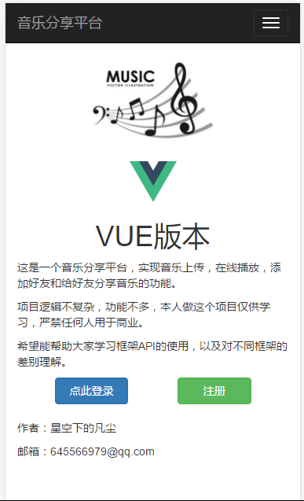

# musicShare
音乐分享平台（同一项目，四种主流框架搭建）

该项目使用四种主流框架搭建

angular, vue, react, angular2

后台使用nodeJS与mongoDB, 想拉下来自己搭建测试的同学详见下方的 [部署说明](#deploy)

## MS-angular
使用原生JS搭建angular框架

无自动化构建工具

前端包用bower下载，为了方便就直接放在git里面了

请进入该文件夹查看更多angular项目相关说明

## MS-vue-ES6
使用webpack自动化构建工具构建

项目使用ECMAscript6语法

请进入该文件夹查看更多vue项目相关说明

## MS-react-ES6
使用webpack自动化构建工具构建

项目使用ECMAscript6语法

请进入该文件夹查看更多react项目相关说明

## MS-angular2-TS
使用webpack自动化构建工具构建

项目使用Typescript语法

请进入该文件夹查看更多angular2项目相关说明

<h2 id="deploy">部署说明</h2>

项目需要安装node,npm与webpack的指令，这里不再赘述

关于数据库的搭建，请下载mongoDB

数据库的可视化操作可使用Studio 3T软件来查看

数据库需要本地搭建，如果需要远程，请进入各个项目的 *proxy* 文件夹，修改下面的代码

    exports.DB = {
	    uri: "mongodb://localhost:27017/musicSharing",
	    auth: false
	};

七牛云目前使用我本人的账号，存储空间有限，如果想使用自己的七牛云，请修改公钥和私钥，请进入各个项目的 *proxy* 文件夹，修改下面的代码

	exports.qiniu = {
		ACCESS_KEY : 'XlXWymRk8gQfrH7Rp4ZlMHl5dYizWWMsPCiHsEs-', 
		SECRET_KEY : '2x3FE_0qdXySDn8QtbZ85Dh58gr3Yyo9nLV6ehFr'
	}

## 项目页面说明
本项目是音乐分享平台，利用七牛云存储音乐文件，来达到在线听音乐，上传音乐，添加好友，分享音乐链接的功能

本项目结构简单，可以更好的上手对于框架的使用

一共5个页面

### main
###### 首页欢迎页面
 

### login
###### 登录页面
 

### home
###### 个人主页面
 

### checkFriendRequest
###### 好友管理页面
 
 

### checkShareRequest
###### 分享管理页面
 
 
 

## 项目自制组件说明
项目一共用了3个自制组件，分别用框架不同形式构建

### musicNav
###### 用于跳转的导航栏（封装了bootstrap的UI）
 

### musicUploader
###### 上传音乐组件
 

### musicModal
###### 点击弹出的拟态框（封装了bootstrap的UI）
 

## 数据库说明
数据库很简单

一共4个表

可参照文件 _各个项目/proxy/mongoose-schema.js_ 

	var UserSchema = new Schema({
		name : String, 
		songs : [{type : Schema.Types.ObjectId, ref : "Song"}], 
		password : String, 
		interest : String, 
		friends : [{type : Schema.Types.ObjectId, ref : "User"}], 
		share : [{type : Schema.Types.ObjectId, ref : "Song"}]
	});
	var SongSchema = new Schema({
		name : String, 
		url : String
	});
	var ShareRequestSchema = new Schema({
		song :  {type : Schema.Types.ObjectId, ref : "Song"}, 
		owner : {type : Schema.Types.ObjectId, ref : "User"}, 
		target : {type : Schema.Types.ObjectId, ref : "User"}, 
		status : Number
	});
	var FriendRequestSchema = new Schema({
		origin : {type : Schema.Types.ObjectId, ref : "User"}, 
		target : {type : Schema.Types.ObjectId, ref : "User"}, 
	    status : Number
	});

## 后续更新
即将增加vue框架同时使用vuex状态管理的版本

